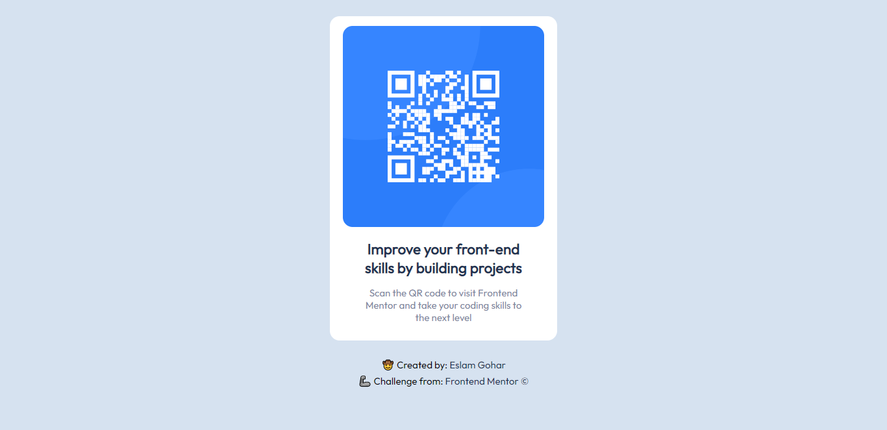

# Frontend Mentor - QR code component solution

This is a solution to the [QR code component challenge on Frontend Mentor](https://www.frontendmentor.io/challenges/qr-code-component-iux_sIO_H). Frontend Mentor challenges help you improve your coding skills by building realistic projects. 

## Table of contents

- [Overview](#overview)
  - [Screenshot](#screenshot)
  - [Links](#links)
- [My process](#my-process)
  - [Built with](#built-with)
  - [What I learned](#what-i-learned)
  - [Continued development](#continued-development)
  - [Useful resources](#useful-resources)
- [Author](#author)


## Overview
It's a first challenge from Frontend Mentor Challenges.
It's a QR code image card component built using only HTML & CSS and responsive on desktop and mobile screen.

### Screenshot




### Links

- Solution URL: (https://github.com/EslamGohar/QR-code-component)
- Live Site URL: (https://eslamx-qr-code.netlify.app/)

## My process

### Built with

- Semantic HTML5 markup
- CSS custom properties
- Flexbox

### What I learned

I tried to use css unit (rem) which means that the root element's font-size (html).
If you change the <html> element's font-size in the CSS you will see that everything else changes relative to it
like 'rem' unit.
To see how you can add code snippets, see below:

```css
html {
   font-size: 62.5%;
}

body { 
  font-family: 'Outfit', sans-serif;
  font-size: 1.5rem;
  background-color: hsl(212, 45%, 89%)
}
```

### Continued development

I would like to make my own QR code generator. so, this could be used as a default template.\
The QR code could be links to a document or something along. Going to think about something useful that could come in handy.

## Author

- GitHub - [Eslam Gohar](https://github.com/EslamGohar)
- Frontend Mentor - [@EslamGohar](https://www.frontendmentor.io/profile/EslamGohar)
- Twitter - [@eslamx_](https://www.twitter.com/eslamx_)
